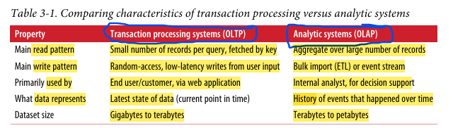
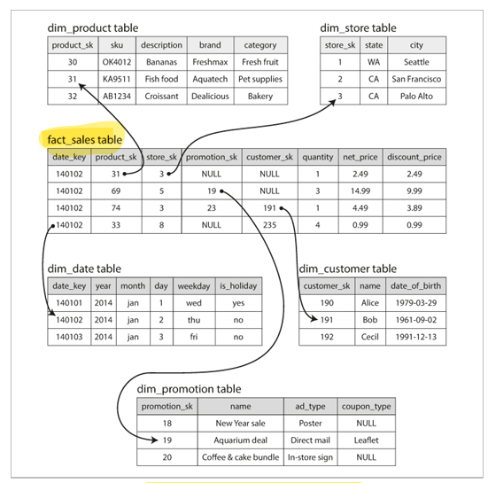
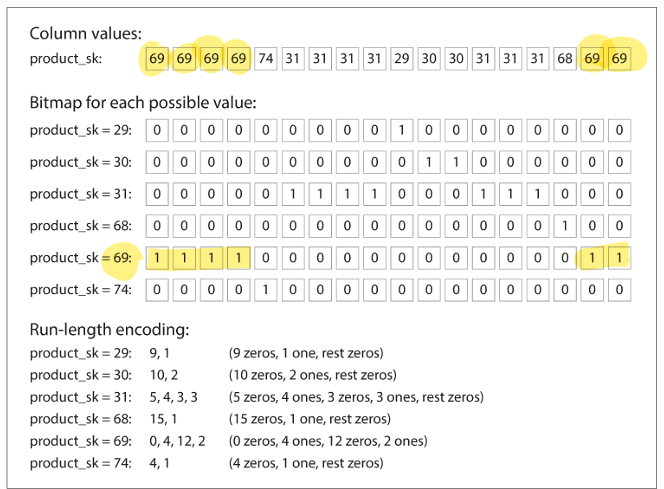

# Daily Log

**Date:** 24 January 2026

---

## ملخص اللي ذاكرته

Chapter 3 Storage and Retrieval

- Transaction Processing or Analytics?
  - Data Warehousing

  - Stars and Snowflakes: Schemas for Analytics

- Column-Oriented Storage

  - Column Compression

  - Sort Order in Column Storage

  - Writing to Column-Oriented Storage

  - Aggregation: Data Cubes and Materialized Views
  

---
## تلخيصي للي ذاكرته + شرحي

## Transaction Processing or Analytics (OLTP vs OLAP)

خلينا ناخد الموضوع من الأول.
يعني إيه أصلًا Transaction؟

زمان الداتابيز والكمبيوتر عمومًا كانوا معمولين للبزنس، فالـ write كان معناها عملية تجارية: بيع، أوردر، دفع مرتبات. من هنا كلمة Transaction جات.

مع الوقت الدنيا وسعت، وفضل نفس الاسم، بس بقى معناها شوية writes و reads مع بعض. مش شرط تبقى ACID زي الـ batch jobs اللي بتشتغل مرة في اليوم مثلًا.
Transaction processing معناها low latency reads & writes.

### OLTP – Online Transaction Processing

ده شكل الـ Transaction اللي بنشوفه كل يوم في الويب أبلكيشنز. كويري بترجع شوية records، أو insert / update. من الآخر تعامل مباشر مع اليوزر.
الداتا هنا بتبقى آخر حالة للداتا.

### OLAP – Online Analytical Processing

هنا الوضع مختلف. مش عايزين اليوزر يعمل كويريز مباشرة.
الهدف إننا نفهم الداتا ونطلع منها قرارات.

الكويريز بتبقى على ملايين الصفوف وعدد أعمدة قليل، وفيها عمليات إحصاء.
الداتا هنا عبارة عن history of events.



---

## Data Warehousing

إيه الفكرة وليه بنحتاجه؟

في أي شركة كبيرة بيبقى عندك website، وفروع، وHR، وsuppliers. كل واحد ليه سيستم وداتابيز لوحده، ولازم تبقى سريعة.
أي كويري تقيلة ممكن توقع السيستم أو تبطّله.

ليه الـ OLTP مش مناسب للـ Analysis؟
لأننا بنعمل scans كتير على الداتا، وده بياخد وقت وCPU وI/O، فكل السيستم يتأثر.

هنا ييجي دور الـ Data Warehouse.
هو Database منفصلة، غالبًا read-only، فيها نسخة من الداتا المهمة من كل الـ OLTP systems.
اللي عايز يعمل analysis يتوصل عليها ويشتغل براحتُه.

### الداتا بتوصل إزاي؟

عن طريق ETL.

Extract: نجيب الداتا من كل الـ OLTPs والـ logs والـ events.
Transform: نضبط الداتا وننضفها ونخليها مناسبة للـ analysis.
Load: نحطها في الـ Data Warehouse.

كده بقى عندنا داتا متجمعة من كل السيستم ونقدر نحللها.

جملة
let business analysts run ad hoc analytic queries
معناها إن اللي بيعمل كويري ممكن يفكر ويجرب كويريز مش متخطط لها مسبقًا، زي آخر شهر من هنا أو آخر سنة من هنا.
الحاجات دي لو اتعملت على الـ OLTP ممكن تبوّظ السيستم.

لحد هنا الاتنين SQL.
طيب إيه اللي وجع دماغنا؟

الاختلاف الحقيقي في الـ internals.
الـ OLTP optimized للـ point lookups، indexes زي B-Tree، وlow latency.
الـ Data Warehouse optimized للـ full scans، aggregation، قراءة أعمدة قليلة، وmassive parallelism.

إن DB واحدة تعمل الاتنين بكفاءة عالية صعب جدًا.
في Databases بتحاول تعمل ده زي Microsoft SQL Server و SAP HANA،
بس عمليًا بيبقى جواها engine للـ OLTP وengine للـ OLAP، مع SQL interface واحدة.

---

## Stars and Snowflakes: Schemas for Analytics

الـ data models في الـ Data Warehouse مختلفة عن الـ OLTP.
في الـ OLTP في models كتير لأن كل أبلكيشن ليه احتياجاته.
في الـ Data Warehouse الهدف الأساسي هو التحليل.

أشهر نموذج هو Star Schema.

ليه اسمه Star؟
لأن في النص Fact Table، وحواليه Dimension Tables.

### Fact Table

ده قلب الـ Data Warehouse.
بيشيل events.
في مثال السوبر ماركت، كل row تمثل شراء منتج واحد.

الأعمدة نوعين:
Measures: قيم بنحسب عليها زي price وcost.
Foreign Keys: بتشير للـ dimensions وبتجاوب على فين، إمتى، إزاي.

### Snowflake Schema

الفرق إن الـ dimensions نفسها بتبقى normalized أكتر ومتفككة.
ده بيزود الـ joins ويصعّب الاستخدام، عشان كده أغلب الناس بتميل للـ Star Schema.



---

## Column-Oriented Storage

ليه نسيب التخزين الـ row-oriented؟

الـ Fact Table فيها داتا ضخمة وعدد أعمدة كبير.
الكويري بيقرا ملايين الصفوف لكنه يستخدم 4 أو 5 أعمدة بس.
يعني بنقرا داتا مالهاش لازمة.

الحل إننا نخزن كل عمود لوحده.
كده لما نحتاج أعمدة معينة نقرأها هي بس، ونوفّر CPU وMemory.

مع Column Compression الأداء يتحسن أكتر، لأن القيم بتتكرر وبتبقى patterns واضحة.

### Bitmap Encoding

تخيل عمود فيه مليارات الصفوف، بس عدد القيم قليل.
بدل ما نخزن القيمة لكل صف، بنحوّل العمود لـ array من 0 و1.
كل قيمة ليها bitmap.



### Vectorized Processing

الداتا بتتحمل في blocks تناسب L1 Cache.
وبيتم استخدام SIMD instructions، وده بيبقى سريع جدًا.

---

## تنفيذ WHERE clauses بسرعة

مثال:

```sql
WHERE product_sk IN (30, 68, 69)
```

اللي بيحصل:
Load bitmaps
OR بينهم
خلصنا

مثال تاني:

```sql
WHERE product_sk = 31 AND store_sk = 3
```

اللي بيحصل:
AND بين الـ bitmaps
عشان نفس ترتيب الصفوف

عمليات bitwise أسرع بكتير من أي loop.

---

## Aggregation (Materialized Views & Data Cubes)

معظم كويريز الـ Data Warehouse بتعتمد على aggregation زي
COUNT و SUM و AVG و MIN و MAX.

لو نفس التجميعات بتتكرر في كذا كويري، إعادة الحساب كل مرة بتبقى waste.

هنا ييجي دور الـ materialized views.
هي زي الـ view العادية، بس نتيجتها متخزنة فعليًا على الـ disk.
يعني select منها = قراءة نتايج جاهزة.

عيبها إن لما الداتا تتغير، لازم تتحدث، وده يخلي الـ writes أغلى.
عشان كده مش مناسبة للـ OLTP، لكن ممتازة في الـ Data Warehouses.

نوع خاص منها هو الـ Data Cube أو OLAP Cube.
بنحسب aggregates مسبقًا على combinations من dimensions زي date وproduct وstore.

الميزة إن كويريز كتير بتبقى سريعة جدًا.
العيب إن المرونة أقل، ولو سؤال خارج الـ dimensions دي مش هيتجاوب.

عشان كده أغلب الـ data warehouses بتحتفظ بالـ raw data،
وتستخدم الـ aggregates و الـ data cubes كـ optimization مش أكتر.

