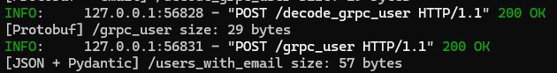
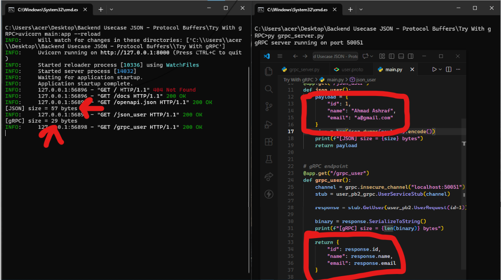
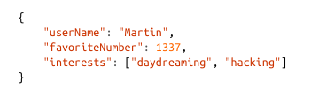
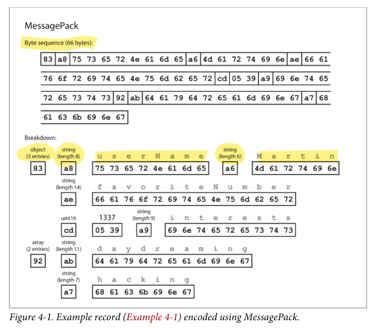
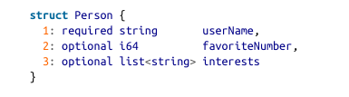
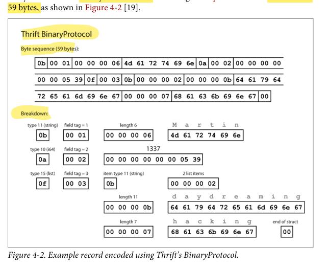
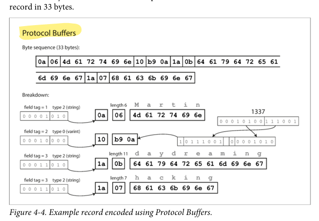

# Daily Log

**Date:** 25 January 2026

---

## ملخص اللي ذاكرته

Capter 4 Encoding and Evolution
- Formats for Encoding Data
  - Language-Specific Formats
  - JSON, XML, and Binary Variants
  - Thrift and Protocol Buffers
  - Avro
  - The Merits of Schemas

---

## المشاكل اللي عندي

انا الدنيا تمام بس انا بحب التطبيق ف مش عارف اطبق ازاي و قعدت كتير عملت البروتوكول بافر ب بايثون و FastAPI كمان بس في مشكله اني مش عارف اشوف تطبيق حقيقي اعمله بسيط حتي غير اني اعمل كومبايل ل فايل ال pf 
ف انا معرفش انا كدا تمام افهم واعرف من غير ما اطبق ولا ايه عشان انا بصراحه بحب اطبق عشان منساش 

جربت اعمل  حاجه بسيطه ب FastAPI واشوف فرق  ال res و فهمت شويه اهو 

عملت كمان حاجه بسيطه برضو بال gRPC اه انا مش فاهمها بصراحه كلها لسا ولا فاهم الكود 100% بس حبيت اشوف النيتجه عامله ازي و طلعت ده

---

## تلخيصي للي ذاكرته + شرحي

الشابتر ده بيتكلم عن التطور و التغير اللي بيحصل في السيستم عموما مع اضاق فيتشر او ما شابه و ده مصطلح اسمه ال **Evolvability** يعني السيستم يبقي قادر انه يتغير و يواكب التغيرات دي بدال ما نهد و نبني.

التغير مش شرط فيتشر، ممكن حتي field جديد او طريقه عرض جديده.

تعالي نبص من ناحيتين، الاولي الداتا بيز.

### Relational Database

في ال Relational Database دي عندها schema واحده شغاله و اي تغيير كان بيبقي عن طريق ال ALTER مثلا او ال migration و مفيش mix بين الداتا.

### Schema-on-read / Schemaless (NoSQL, Document DBs)

طيب ال Schema-on-read زي او schemaless زي ال NoSQL , Document DBs دي مفيش schema يعني ممكن نلاقي قديم و جديد سوا و دي مرنه اوي طبعا.

---

## الكود

التانيه الكود، المشكله الحقيقيه بقا ف الكود لانه مهما غيرت الداتا بيز الكود مش بيتحدث معاها و لما نحدثه مش بيتحدث كله ف نفس اللحظه لان الكود كبير جدا.

### Server-side

زي ال Rolling Upgrade و تحديثات ال Node Node يعني هيبقي عندك ف لحظه حبه شغالين قدام و حبه جداد.

### Client-side

المستخدم ممكن ميعملش update اصلا و يفضل ب القديم.

---

## Compatibility

هنا عندنا مفهوم تاني مهم اوي اسمه ال **Compatibility**.

### Backward Compatibility

يعني ان الكود الجديد يعرف يقري داتا قديمه و دي سهله نسبيا لاننا عادي عارفين ان الكود عندنا و عارفين الداتا.

### Forward Compatibility

يعني ان الكود القديم يعرف يتعامل مع داتا جديده و ده الصعب لانه ممكن يجيله حاجات مش فاهمها ف ممكن يكون خادع شويه لانه لازم الكود يحاول يسيبه من الداتا الجديده اللي جايه من التعديل الجديد.

---

## Formats for Encoding Data

هنتكلم عن فكره ازاي البرنامج بيتعامل مع الداتا بأكتر من شكل علي حسب هو بيشتغل فين.
طيب يعني ايه فين؟ الداتا ليها شكلين.

### In-Memory Representation

دي ان الداتا تتحفظ جوا البرنامج ف Objects و Data Structures زي ال List , Array, Hash Table, Tree وكدا.
والشكل ده مهم عشان يكون سريع في ال CPU و بيعتمد علي Pointers.

### Byte Sequence Representation

ده لما الداتا تخزن ف ملف و نبعتها علي Network لازم تتحول ل sequence of bytes زي مثلا ال JSON XML Binary، لان ال Pointers ملوش معني برا ال process يعني لما يخرج من برنامج ل برنامج.

---

## Translation

طيب الحل ايه؟ Translation.
لازم نعمل ترجمة بين الشكلين.

Encoding (Serialization / Marshalling): من in-memory → bytes
Decoding (Deserialization / Parsing): من bytes → in-memory

ليه ده مهم بقا؟ عشان دي مشكله حقيقيه لازم هتواجهك ف بقي ليها حلول زي Formats او Libraries كتير.

---

## Language-Specific Formats

لغات كتير بتوفر Encoding جاهز، Java عندها Serializable و Python عندها pickle.
دول سهلين تستخدمهم في البرنامج بتاعك و سريع ال save , Load.

و زي ما متعودين قبل ما نقول الحل نمسك ف المشكله وهي ان اللي مثلا اتعمله encoding ب Pickle و عايز تقراه ب Go مثلا مش هنعرف، ف انت كدا ربطت نفسك بلغه واحده و التعامل مع الابلكيشنز بقا صعب.

كمان ف ال security، Decoding بيعمل instantiate لأي class، و لو attacker بعت byte sequence خبيث يقدر يعمل Remote Code Execution.

---

## مشاكل الـ Versioning

Versioning ضعيف، Forward compatibility و Backward compatibility.
أي تغيير بسيط في الـ class ممكن يكسر الداتا القديمة، وده عكس الـ Evolvability اللي احنا بنحاول نوصله.

---

## JSON, XML, and Binary Variants

لما نسيب الـ language-specific formats و نروح لحاجه تقراها لغات البرمجه كلها يبقي هنفكر في JSON و XML و CSV.
XML هو معقد زياده شويه، JSON ابسط و شغال Native في المتصفحات و عشان كدا انتشر، CSV ده بسيط و ضعيف ف التعبير عن الداتا المعقده.

بس حلوين ف انهم Text-based و Human-readable.

---

## مشاكل الـ Text Formats

### لخبطه الارقام

ال CSV و XML مش عارف ده رقم ولا string الا لو في schema برا.
ال JSON بيفرق بين string و number بس مش بيفرق بين float و integer.

هتقولي يا عم هي دي مشكله ما انا يعني عارف الجاي، هقولك لا المشكله بتبان علي الارقام الكبيره، اي رقم اكبر من 2 اس 53.

ف ال JS بيقراه غلط عشان بيستخدم floating point، وبيستخدم standard اسمه IEEE 754 double-precision.

---

## Double-Precision

يعني إيه Double-Precision؟
الرقم بيتخزن في 64 bit: 1 bit sign، 11 bits exponent، 52 bits mantissa (الدقة).

وده معناه ان JavaScript يقدر يمثل أرقام صح لحد 2⁵³ - 1 بس.
Number.MAX_SAFE_INTEGER = 9007199254740991.

---

## JSON vs Binary

JSON أقل verbose من XML، بس الاتنين كبار مقارنة بالـ binary.
ده أدى لظهور Binary JSON formats زي MessagePack و BSON و UBJSON، و Binary XML formats زي WBXML و Fast Infoset، بس ولا واحد فيهم انتشر زي النصّي.

---

## ملاحظات مهمة عن Binary JSON

بعضهم بيفرق بين int و float و بيدعم binary strings، بس نفس data model بتاع JSON و مفيش schema.
يعني لازم يكرر أسماء الـ fields جوه كل record.

مثال ف الصورتين دول:

---

## Thrift and Protocol Buffers

هما ف الاساس Binary encoding و يعتبرو schema-based يعني قبل ما تبعت او تخزن لازم تكون عارف شكل الداتا و الداتا تايبس.

### Thrift

و ليه نوعين.

#### Thrift BinaryProtocol

كل field فيه type و length و value، الحجم 59 bytes.

#### Thrift CompactProtocol

نسخة أذكى، بيدمج type + tag في byte واحد و بيستخدم variable-length integers.
مثال 1337 بدل 8 bytes تبقى 2 bytes بس، الحجم 34 bytes.

---

## Protocol Buffers

فكرة قريبة جدا من CompactProtocol، Packing مختلف شوية، الحجم 33 bytes.

---

## Schema Evolution

إزاي الداتا بتتفهم؟
الداتا = fields ورا بعض، كل field ليه tag number و datatype.

لو field مش موجود بيتشال خالص و مفيش null.
تغيير اسم field عادي لان الاسم مش موجود في الداتا أصلاً.
تغيير tag كارثة، كل الداتا القديمة تبقى meaningless.

Rule ذهبية: الـ tag عمره ما يتغير.

---

## Adding / Removing Fields

إضافة field جديد ينفع بشرط Tag جديد و field يكون optional أو له default.
Old code يشوف tag مش فاهمه يعمل skip، datatype يقول له يعدي كام byte، وده يحقق Forward compatibility و Backward compatibility، و New code يقرا old data عادي.
بس مينفعش تضيف field required لأن old data مش كاتبه.

حذف field ينفع بس يكون optional و tag لا يُعاد استخدامه أبدًا، لأن ممكن تلاقي داتا قديمة لسه موجودة.

---

## Changing Datatypes

تغيير datatype ينفع أحيانًا بس خطر.
مثال int32 → int64، new code يقرا old data عادي.
العكس، old code يقرا new data الرقم كبير؟ يحصل truncation.
