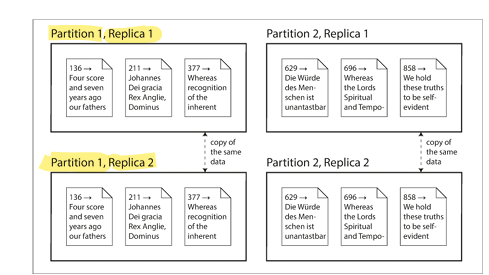
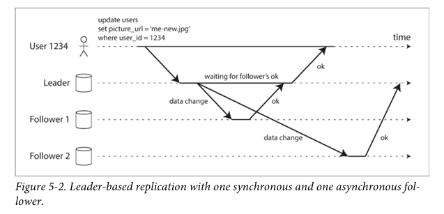
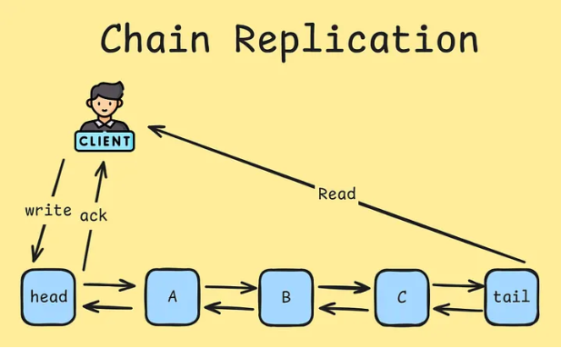

# Daily Log

**Date:** 27 January 2026

---

## ملخص اللي ذاكرته

- Part II. Distributed Data
  - Difference between To Replication and Partitioning
  - Chapter 5 Replication
    - Leaders and Followers
        - Synchronous Versus Asynchronous Replication
        - Chain Replication

        
---

## تلخيصي للي ذاكرته + شرحي

## Distributed Data

بعد ال Part الاول اللي اتكلمنا فيه عن الداتا و اشكالها و ال Models هنتكلم دلوقت علي تاني بارت و هو **Distributed Data**.

في Part I كنا بنتكلم عن داتا سيستم شغال على ماشين واحدة، لكن هنا ايه يحصل لما نوزع الداتا علي اكتر من ماشين؟

ده الاول هيحصل امتي؟ هيحصل لأسباب زي: **Scalability, High Availability/Fault Tolerance, Latency**.

### Scalability

ده لما الداتا تكبر و عدد ال read/writes اللي بيحصل يبقا صعب انه يستحمله ماشين واحدة. هنا بنروح نعمل scale للماشين بتاعتنا سواء **scale up/out** زي ما اتكلمنا.

### High Availability / Fault Tolerance

تاني حاجة، وهي ان السيستم يفضل شغال حتي لو ماشين وقعت أو شبكة أو حتي Data Center كامل. دا حله اننا نعمل أكتر من نسخة من الداتا و أكتر من ماشين شغاله.

### Latency

مثلا تخيل معايا عندك users في مصر و اوروبا و امريكا وكلهم بيكلموا Data Center واحد بس في امريكا. طبعا بسبب البعد هيبقي ال latency عالي، والحل ان السيرفرات تتوزع قريب من اليوزرز جغرافيا و اليوزر يوصل لاقرب واحد ليه عشان يبقي سريع.

---

## Vertical Scaling (Scaling Up)

أولا، هل لازم نعمل ده ولا ليه حالات؟
عندنا حاجة اسمها **Vertical Scaling (Scaling Up)**: نجيب ماشين أقوى **CPU, RAM, Disks**.
ده اسمه **shared-memory architecture**.

مشاكله:

* السعر بيزيد جامد.
* **Single Point of Failure**: لو الماشين وقعت السيستم كله وقع.
* كمان صعب نوزع جغرافياً.

---

## Architectures

هل لل Architectures دول انواع؟ بص كده:

### 1) Shared-Memory

كل CPUs تشوف نفس الـ RAM والـ Disk. سهل في البرمجة، صعب في ال scale.
معلومة مهمة: حتى هنا فيه partitioning بسبب **NUMA (Non Uniform Memory Access)**.

### 2) Shared-Disk

CPUs و RAM منفصلين لكن الـ Disk مشترك.
لما كذا حاجة تشير لنفس الداتا هيبقي عندنا **Locking** وده مشاكل، وكمان مش Scalable اوي، بس مفيد في حالات زي **Data warehousing**.

### 3) Shared-Nothing

كل Node لوحده حرفيا، ملهوش دعوه بأي حاجة من التاني وبيتواصلو ب **Network**.
مميزاته: أرخص وأسهل في ال scale ويتحمل وقوع أي Data Center.

---

## Partitioning (Sharding) vs Replication

### Replication

يعني نفس الداتا متخزنه علي أكتر من Node عشان تبقي قريبة من اليوزرز وكمان لو حاجة وقعت أو باظت اقدر أجيبها تاني.

### Partitioning (Sharding)

هنا نقسم الداتا: كل Node ماسك جزء. فايدتها: **Scalability** و حجم أقل لكل Node.
مثال: عندنا داتا 3 سنين، ممكن نقسمها كل سنة في Node، يبقا كل Node يشوف داتا أقل، أسرع ومركز أكتر.

غالبا ممكن نستخدمهم سوا.

---

## Replication Details

زي ما قولنا، Replication معناه نسخ نفس الداتا على أكتر من Node متصلة بالشبكة.

المشكلة الأساسية:

* لو الداتا **Static**: سهلة، نسخ مرة واحدة.
* لو الداتا **Dynamic**: الصعوبة بتبدأ.

### Algorithms المشهورة للـ Replication

1. Single-leader replication
2. Multi-leader replication
3. Leaderless replication

---

### Leader-Based Replication (Active/Passive / Master–Slave)

كل Node معاه نسخة من الداتا، كل نسخة اسمها **Replica**.
مين المسؤول عن كتابة الداتا؟ **Leader (Master / Primary)**، باقي الـ Replicas بيكونوا **Followers (Slaves / Secondaries)**.

#### الخطوات الأساسية

1. **Leader**: أي write request لازم تروح للـ Leader. Leader بيكتب الداتا على Local Storage بتاعه.
2. **Followers**: كل مرة Leader يكتب داتا جديدة، بيبعتها للـ Followers. كل Follower بياخد Replication Log ويطبق الداتا بنفس ترتيب Leader.
3. **Reads**: أي client ممكن يقرأ من Leader أو أي Follower، لكن Writes بس على Leader.

Leader-based replication موجود في:

* Relational DBs: PostgreSQL, MySQL, Oracle, SQL Server
* Non-relational DBs: MongoDB, RethinkDB, Espresso
* Distributed messaging: Kafka, RabbitMQ
* Filesystems & block devices: DRBD

---

### Synchronous vs Asynchronous Replication

لما يكون عندك Leader + Followers، مهم تعرف إزاي الـ data بتتوزع عليهم: **synchronous** ولا **asynchronous**.

#### Synchronous Replication

الفكرة: Leader يستنى Follower يأكد استلام الداتا قبل ما يقول للكلاينت ان write تمت.

**ميزة**: الداتا مضمونة ومتحدثة، ولو Leader وقع النسخة عند Follower سليمة.
**عيوب**: لو Follower وقع أو مش قادر نوصل له بسبب الشبكة، الـ write هيقف.

**حل عملي**: واحد بس synchronous والباقي asynchronous (**semi-synchronous replication**) لضمان نسخة حديثة على الأقل على 2 nodes: Leader + Synchronous Follower.

#### Asynchronous Replication

Leader يبعت الداتا لل Followers ومش مستنى الرد.

**ميزة**: Leader يقدر يكمل كتابة الداتا حتى لو Followers متأخرين، مناسب للتوزيع الجغرافي.
**عيب**: لو Leader وقع قبل ما الداتا توصل للFollowers → بعض الـ writes ممكن تضيع، مش مضمون 100% durability حتى لو client اتأكد أن write نجح.

---

### Research on Replication

#### المشكلة في Asynchronous Replication

لو Leader وقع قبل ما الداتا توصل للFollowers، ممكن تضيع داتا → النظام مش مضمون  للـ durability.

#### Research

الResearchers  اشتغلوا على طرق replication تحافظ على الداتا ومتضيعهاش  وتحافظ على Performance وتكون دايمًا متاحة.

**مثال: Chain Replication**

> Chain replication is a protocol, mainly designed to meet the goals mentioned above: durability and consistency. Simply from its name, it pipelines writes through a linear chain of replicas to achieve high throughput and strong consistency. This requires the system to specify a head replica and a tail one. When the client wants to write, it writes to the head. Head writes locally, forward to next replica and so on until the write reaches the tail. While the tail writes, it sends back an acknowledgement to the client (travelling back up the chain). Not only this, all read requests come to the tail, this ensures us that we got the committed data across all replicas.

Link: [Link to medium](https://medium.com/@m.hassan.def/chain-replication-how-does-azure-storage-handle-replication-under-the-hood-79acbd3ac441)

* نوع من الـ synchronous replication
* مستخدم في أنظمة زي **Microsoft Azure Storage**

