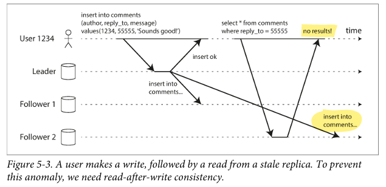
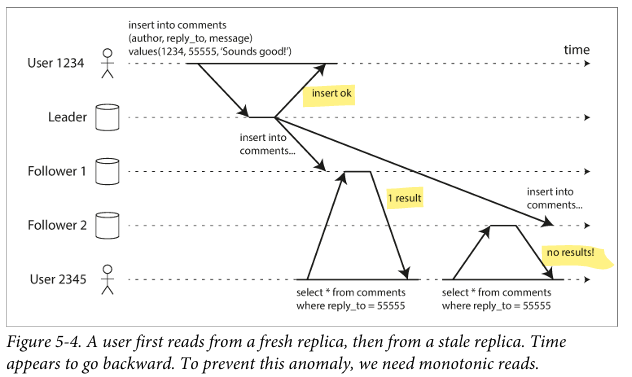
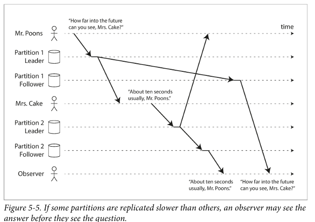

# Daily Log

**Date:** 30 January 2026

---

## ملخص اللي ذاكرته

- Chapter 5 Replication
  - Problems with Replication Lag
    - Reading Your Own Writes
    - Monotonic Reads
    - Consistent Prefix Reads
    - Solutions for Replication Lag
  - Multi-Leader Replication
    - Use Cases for Multi-Leader Replication
    - Handling Write Conflicts
    - Multi-Leader Replication Topologies
---

## تلخيصي للي ذاكرته + شرحي
# Problems with Replication Lag

هنتكلم على حبة المشاكل اللي بتحصل في الـ Replication

عندنا ال Leader كل الـ Leaders كل الـ writes بتروح له، و الـ Followers بياخدوا نسخة من الداتا و غالبًا بنقرا منهم. طيب كان ليه ده في الأساس؟ خلينا نفتكر: عشان لو سيرفر وقع أو في load أو latency كل ده يعني.

## Read Scaling Architecture

لو جينا نفكر هنلاقي إن أغلب الشغل بتاعنا reads لكن الـ writes قليلة. الحل نلخي Reads تروح على الـ followers و نسيب الـ leader لل writes بس و ده بيخلي السيستم يبقى أسرع و يتحمل.

## ليه Async Replication مش Sync

لو عملنا Sync أي follower يقع أو النتورك تقف، الـ writes كلها بتقف.

المشكلة بقى في Async Replication هي الـ Replication Lag. يعني الـ leader استقبل write والـ follower لسه ماخدش الداتا. فاللي يحصل:  
Query على الـ leader → داتا جديدة  
Query على follower → داتا قديمة  

ده طبعًا inconsistency، بس ده مش دايم، مش زي ما يكون مش هتيجي خالص. لا، لو استنينا حبة الـ replicas الباقية هيجيلها التحديثات و ده اللي بنسميه الـ Eventual Consistency. يعني الداتا هتبقى consistent بس مش دلوقتي.

---

## Reading Your Own Writes

المشكلة دي زي ما في الصورة كده:  
ال User كتب حاجة وال write راح لل Leader، بعد ثانيتين عمل refresh راح لل follower، وال follower لسه متأخر (Lag).  

اسم المشكلة: Read-After-Write Anomaly  
و الحل: Read-After-Write Consistency أو Read-Your-Writes  

يعني ايه بقى؟ لو أنا عملت write وبعدها read لازم أشوف الحاجة اللي كتبتها.  

**الحلول:**  
1. نقرا من الـ Leader لو الحاجة الـ user عدلها. يعني لو البروفايل بتاعك تقرأ من الـ Leader، أما بروفايل حد تاني من الـ follower، كده كده مش زي أهمية بروفايلي لو أنا عملت فيه تعديل.  
2. Time based rule: بعد الـ write اقرا من الـ Leader بقد إيه.  
3. أراقب الفولورز وأشوف بياخدوا قد إيه واللي بيتأخر أوي مقراش منه.  
4. الـ client يحتفظ بـ timestamp آخر write، لما الـ user يعمل write، السيستم يديله timestamp، ميقراش غير بعدها.

---

## Monotonic Reads

زي ما باين من الصورة دي معناها: أشوف داتا جديدة وبعدين فجأة أشوف أقدم منها.  

الحل: كل user يتربط بـ replica معينة. أي read له → نفس الـ replica.

---

## Consistent Prefix Reads

المشكلة بتحصل إزاي في السيستم؟  

تخيل:  
كلام Mr. Poons متخزن في Partition A  
كلام Mrs. Cake متخزن في Partition B  
والـ Replication Lag:  
Partition B سريع  
Partition A بطيء  

Observer (user ثالث):  
قرأ من Replica B → شاف الرد  
قرأ من Replica A → شاف السؤال بعده  

فاللي يظهر له: الإجابة قبل السؤال.  

ليه دي أسوأ من المشاكل اللي قبلها؟  
هنا مش بس: داتا قديمة أو الزمن رجع شوية، لا… المنطق نفسه بايظ.  

**يعني إيه Consistent Prefix Reads؟**  
ببساطة: لو حصلت Writes بترتيب معين، أي حد يقرأهم لازم يشوفهم بنفس الترتيب.  

**الحلول:**  
1. خلي الـ causally related writes في نفس الـ partition، يعني السؤال والرد في نفس shard.  
2. Global ordering: كل write يعدي على coordinator يدي order موحد.

---

## Multi-Leader Replication

كل اللي فات كان Leader واحد بس و الباقي followers. المشكلة لو مش عارف توصل لل Leader، مفيش writes.  

الحل: نخلي في أكتر من leader، وده اسمه الـ multi leader أو master-master.  

**ليه منستخدمهوش على طول؟**  
الإجابة بديهية: التعقيد وغالبًا مش مستحق، بس في حالات محتاجينه:

### Multi-Datacenter

عندك Users في:  
- أوروبا  
- أمريكا  
- آسيا  

Single Leader: Leader في أمريكا  
User في أوروبا يعمل write → latency عالي جدًا  

الحل: Multi-Leader: Leader في كل Datacenter  
User يكتب: locally  
Replication يحصل async لباقي الـ DCs

---

### Offline Clients

Calendar Apps: موبايل، لابتوب، تابلت  
كل جهاز يقدر: يقرا، يكتب، حتى وهو offline  
لما الإنترنت يرجع: يعمل sync  

هنا: كل جهاز = Leader  
Replication: بطيئة، مش مضمونة، ممكن تبقى بعد أيام  

---

### Collaborative Editing

Google Docs، Etherpad  
كل User: بيعدل علي جهازه   
التعديلات تتبعت للناس async  

