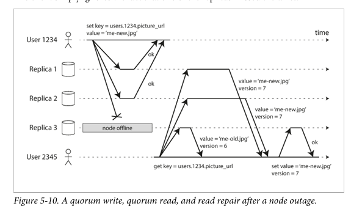
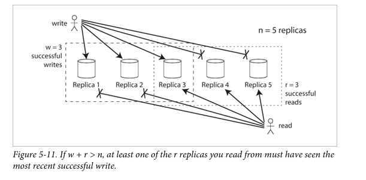

# Daily Log

**Date:** 1 February 2026

---

## ملخص اللي ذاكرته

- Chapter 5 Replication
  - Leaderless Replication
    - Writing to the Database When a Node Is Down
    - Limitations of Quorum Consistency
    - Sloppy Quorums and Hinted Handoff
    - Detecting Concurrent Writes

---

## تلخيصي للي ذاكرته + شرحي

قبل كدا شفنا Single-Leader و Multi-Leader
دلوقت هنتكلم عن ال Leaderless يعني مفيش قائد يدير ال followers وكدا
الفكره ان ال client يبعت الداتا لاكتر من node في نفس الوقت و مفيش ترتيب خالص
ف النظام يضحي بال consistency مثقابل Availability و Latency أقل

لو عندنا 3 replicas و واحده وقعت ال client  عادي هيبعت لل 3 واللي يرد يرد والواقعه هيتجاهلها 
هنا دي مشكله ال stale Reads 
الحل اننا نقرا من اكتر من replica و السيستم يقارن ويقول انهي احدث

في بقا مصطلحين مهمين محتاجين نفهمهم Read Repair & Anti-Entropy
Read Repair
بتحصل وقت الـ read لو لقيت Replica قديمة يرجّع لها القيمة الجديدة

Anti-Entropy
Process في الخلفية يلف بين الـ replicas يشوف مين ناقصه إيه ينقل الداتا

Quorum Read / Quorum Write

عشان دايمًا يبقى في Node مشتركة شافت آخر write وبالتالي القراءة ترجع أحدث قيمة

---

مقدرتش اكتب كتير النهارده بسبب شويه مشاغل اكتفيت بالمذاكره