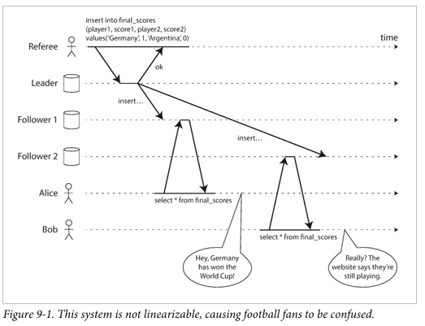
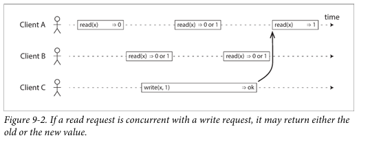

# Daily Log

**Date:** 10 February 2026

---

## ملخص اللي ذاكرته

- Chapter 9 Consistency and Consensus
  - Consistency Guarantees
  - Linearizability
    - What Makes a System Linearizable?
    - Relying on Linearizability
    - Implementing Linearizable Systems
    - The Cost of Linearizability

---

## تلخيصي للي ذاكرته + شرحي

الكتاب هنا بيتكلم عن التحديات في الأنظمة الموزعة (Distributed Systems)، وخصوصًا إزاي نخلي النظام يتحمل الأعطال (fault-tolerant) من غير ما يقفل أو يبوظ الداتا.
زي ما قولنا في Chapter 8، المشاكل اللي ممكن تحصل:
الشبكة ممكن تضيع باكيت (packet)، أو توصل متأخرة، أو تتكرر.
الـ nodes ممكن توقف فجأة (pause) أو crash.
الساعات (clocks) في الأجهزة مش دقيقة.
أبسط طريقة للتعامل مع المشاكل دي: تخلي النظام كله يفشل وتوري اليوزر رسالة خطأ.
لو الطريقة دي مش مقبولة: لازم نعمل النظام fault-tolerant، يعني يفضل شغال حتى لو جزء منه فيه مشاكل.

Consensus
أهم abstraction في الأنظمة الموزعة: الاتفاق بين كل الـ nodes على حاجة واحدة.
مثال : لو عندك database مع single-leader replication، ولو الـ leader مات، لازم نختار leader جديد.
Consensus بيخلي كل الـ nodes تتفق مين الـ leader الجديد.
لو اتنين اعتقدوا إنهم leader في نفس الوقت → split brain → غالبًا بيبوظ الداتا

Consistency Guarantees
لو عندك replicated database، الـ nodes مش هتكون دايمًا متزامنة (replication lag).
معظم الداتا بيز اللي عندها replication بتدّي على الأقل eventual consistency:
لو بطلت تكتب، بعد وقت مش محدد، كل الـ replicas هيتفقوا على نفس القيمة.
لكن مش مضمون امتى هيتفقوا.

Linearizability

المشكلة اللي في eventually consistent database: لو سألت نسختين (replicas) عن نفس الداتا في نفس الوقت، ممكن ترد كل نسخة بحاجة مختلفة. ده بيخلي النظام confusing.
Linearizability بتحاول تحل المشكلة دي عن طريق عمل illusion إن فيه نسخة واحدة بس من الداتا.
يعني حتى لو في الواقع فيه نسخ كتير، الأبلكيشن يحس إنه بيتعامل مع نسخة واحدة بس وكل العمليات عليها atomic (تتم كلها مرة واحدة أو مش تتم خالص).
يعني بتعمل ايه و بتضمن ايه؟
أول ما أي client يعمل write ناجح، أي client تاني يعمل read لازم يشوف القيمة الجديدة على طول.
بمعنى آخر: linearizability = recency guarantee → أي قراءة بعد الكتابة لازم تكون حديثة ومش من نسخة قديمة.
مثال واقعي من الكتاب:
Alice و Bob بيبصوا على نتيجة ماتش. Alice شافت النتيجة الجديدة فورًا، لكن Bob شاف نسخة قديمة لأن القراءة اتوجهت لنسخة متأخرة. ده violation لل-linearizability.

إيه اللي بيخلي النظام Linearizable؟
كل عملية (read أو write) عندها نقطة زمنية افتراضية atomic بين وقت البداية والنهاية.
لو قراءة client شافت قيمة جديدة، كل القراءات اللي بعدها لازم تشوف نفس القيمة.

initial value: x = 0
Client C بيعمل write(x, 1)
Client A و B بيعملوا read بشكل متكرر:
أي read قبل بداية الـ write → تشوف 0
أي read بعد انتهاء الـ write → تشوف 1
أي read concurrent مع الـ write → ممكن تشوف 0 أو 1
