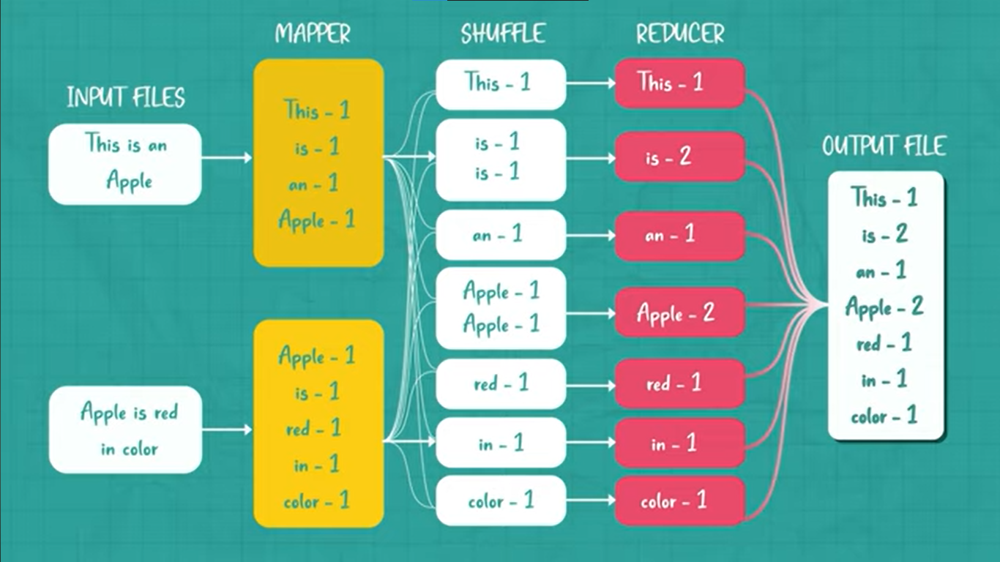

# Daily Log

**Date:** 12 February 2026

---

## ملخص اللي ذاكرته

- Chapter 10 Batch Processing
  - Batch Processing with Unix Tools
    - Simple Log Analysis
    - The Unix Philosophy
  - MapReduce and Distributed Filesystems
    - MapReduce Job Execution
    - Reduce-Side Joins and Grouping
    - Map-Side Joins
    - The Output of Batch Workflows
    - Comparing Hadoop to Distributed Databases

---

## تلخيصي للي ذاكرته + شرحي

الشابتر ده بيتكلم عن انواع انظمه معالجه الداتا و بيفرق بينهم و هنبدا نتكلم عن ال Batch Processing

اولا انواع انظمه Data Processing هما 3 
1) Services (Online Systems)
ده اللي عارفينه و متعودين عليه بيقي مستني اي Request ييجي منم اي Client و السيستم يرد ب Response و اهم حاجتين هنا هما ال Response Time, Availability

2) Batch Processing (Offline Systems)
ده بياخد كميه كبيره من الداتا و يشغل عليها Job و يطلع Output و مفيش حد مستني الرد علطول
ف ال job ممكن تاخد دقايق او ساعات او ايام عادي
وغالبا بيشتغل مره ف الاسبوع او يعني قليل و Scheduled 

3) Stream Processing (Near-Real-Time)
ده ف النص مش بيرد علي Request و بياخد Eent اول ما تحصل و يعمله بروسيسنج بسرعه
Batch → يعالج Dataset ثابتة
Stream → يعالج Events أول ما تحصل

Unix بيستخدم فكرة:
بدل ما نعمل Hash Table في الميموري
نخلي الـ sorting يعمل الشغل
 الفرق بين الطريقتين

الطريقة 1: In-Memory Hash Table (زي Ruby مثال الكتاب) تعمل:
counts[url] += 1
كل URL يتحط في Hash Map. المشكلة؟
لو عندك 100 مليون URL مختلف الميموري هتضرب.

الطريقة 2: Sorting Approach (Unix)
يرتب البيانات التكرارات تبقى جنب بعض uniq يعدهم
لو البيانات أكبر من الميموري → sort يكتب على disk يعمل merge sort يكمل
 ده نفس مبدأ:
LSM Treesو  SSTablesو External Merge Sort
 ليه ده مهم في Distributed Systems؟
لأن نفس الفكرة هي اللي:
MapReduce بيستخدمها Hadoop بيستخدمها Spark بيستخدمها
Map → Sort → Shuffle → Reduce
Unix pipeline = Mini MapReduce على جهاز واحد 

Unix Philosophy دي أهم نقطة في الجزء ده
أربع مبادئ:
كل برنامج يعمل حاجة واحدة بس
sort يعمل sort
uniq يعمل counting
awk يعمل parsing
مش برنامج ضخم بيعمل كل حاجة.

MapReduce and Distributed Filesystems

MapReduce شبه Unix pipeline
بس بدل جهاز واحد → آلاف الأجهزة
يعني بدل:
cat | awk | sort | uniq
يبقى:
Map → Shuffle/Sort → Reduce
لكن موزعين على Machines كتير.

طبيعة MapReduce Job
زي Unix بياخد Input يطلع Output مبيعدلش الـ Input مفيش Side Effects يكتب Output مرة واحدة بشكل Sequential

الـ immutability هنا ده بتسهل
Retry,Fault tolerance, Scalability

