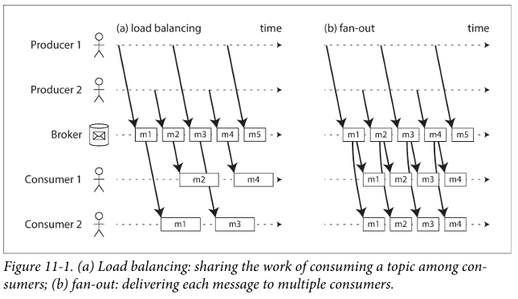

# Daily Log

**Date:** 14 February 2026

---

## ملخص اللي ذاكرته

- Chapter 11 Stream Processing
  - Transmitting Event Streams
    - Messaging Systems
    - Partitioned Logs
  - Databases and Streams
    - Keeping Systems in Sync
    - Change Data Capture
    - Event Sourcing
    - State, Streams, and Immutability

---

## تلخيصي للي ذاكرته + شرحي

تمام 👌 نفس الكلام بالظبط من غير أي تعديل في الصياغة أو حذف أو إضافة، بس منسق Markdown أحسن وباستخدام عناصر أكتر زي **bold** و `inline code` و quote و separators وغيره.

---

# Batch Processing vs Stream Processing

> فال Batch Processing  كنا بنتعامل مع داتا ليها بدايه و ليها نهايه و حجمها معروف
> كنا بنقراها كلها و بعد كدا نطلع نتيجه
> زي مثلا نعمل indexing او نحسب حاجات statistics او نعمل recommendation ف كان الاموضوع ملموم شويه

لاكن المشكله ان الداتا مش بتخلص فعليا يعني هي **Unbounded**

---

## نفهم اكتر:

دلوقت لو اليوزرز كتبو دتا امبارح اكيد هيكتبو النهارده و بكرا و هكذا يعني دايما الداتا ماشيه

---

## الفرق بين Batch و Stream

### Batch Processing

بنجمع داتا فترة معينة `(يوم – ساعة)`
نشغل job عليها
نطلع نتيجة
و نستنى الفترة الجاية

**مثال:**
نحسب عدد الطلبات كل يوم بالليل المشكله ان النتيجة بتظهر متأخر

---

### Stream Processing

ف الحل هنا هو ال Stream Processing

بدال ما نستني اليوم يخلص
لا نعمل بروسيس لل `event` اول ما يحصل

يعني لو ال user عمل order يتحسب علطول و كدا

ده اسمه:

> `Processing Events as they happen`

---

## طب يعني إيه Stream؟

```text
stream = data that arrives incrementally over time
```

يعني الداتا بتيجي واحده واحده مش دفعه واحده

---

## في Batch:

لازم نقرأ كل الداتا قبل ما نطلع نتيجة

**مثال:**
في sorting (زي MapReduce) مينفعش تبدأ تطلع output قبل ما تقرأ كل input لأن ممكن آخر record يكون أصغر واحد.

لكن في Stream إحنا مش بنستنى الداتا تخلص لأنها أصلًا عمرها ما هتخلص.

---

# ليه Stream Processing مهم؟

لأن المستخدمين دلوقتي عايزين:

* Notification فوري
* Real-time analytics
* Live dashboards
* Fraud detection لحظي
* Recommendation مباشرة
* Online monitoring

محدش هيستنى 24 ساعة.

---

# مثال عملي بسيط

تخيل عندك E-commerce:

## Batch

تحسب المبيعات كل يوم بالليل

## Stream

كل ما Order يحصل:

* تحدث dashboard فورًا
* تبعت notification
* تحدث recommendation
* تحدث المخزون

---

---

# Transmitting Event Streams

في ال Batch الملف بيتحول لسلسله من ال Records

انما ف ال Stream كل Record اسمه **Event**

و تعريف ال Event هو:

> Object صغير و مستقل و immutable و بيوصف حاجه حصلت ف وقت معين

---

## بيحتوي علي ايه؟

* بيانات الحدث
* ال Timestamp او وقت حدوثه

وممكن يتكتب ك:

`Text`
`Json`
`Binary Gormat`

---

# Producer vs Consumer

في ال Batch الملف بيتكتب مره و jobs كتير ممكن تقراه

ف ال Stream الحدث بيتعمل مره واحده عن طريق ال:

`Producer (Publisher/Sender)`

و يتقري من:

`Consumers (Subscribers/Recipients)`

---

# Topic أو Stream

ف ال File System اسم الملف بيجمع ال records أللي زي بعض

في ال Streaming بقا ال Events ألمرتبطه بتتحط ف:

> Topic (Stream)

مثلا:

```
Topic: orders
Topic: user_clicks
```

---

# هل نقدر نستخدم Database عادي بدل Streaming System؟

نظريًا آه

ممكن نعمل كده ازاي؟

* Producer يكتب events في database
* Consumer يعمل polling كل شوية
* يشوف هل في records جديدة ولا لأ

وده بالظبط اللي الـ Batch بيعمله.

---

## المشكلة في Polling

كل ما تقلل الزمن بين كل poll والتاني:

* تقل latency
* لكن تزيد overhead

ليه؟

معظم requests مش هترجع حاجة جديدة
بتضغط على الـ DB
بتستهلك network و CPU

يعني لو بتpoll كل ثانية غالبًا مش هيكون في data جديدة كل مرة

---

## الحل الأفضل

بدل ما Consumer يسأل كل شوية:

> "في جديد؟"

نخلي السيستم يقول له:

> "في حدث جديد"

يعني `push` بدل `pull`.

---

# طب ليه منستخدمش Triggers في DB؟

Relational DBs فيها triggers
لكن قدراتها محدودة

مش مصممة كـ event delivery system
كانت إضافة جانبية (afterthought)
مش معمولة عشان تبقى message broker.

---

عشان كده ظهرت أنظمة مخصوص لتوصيل الأحداث زي:

* Apache Kafka
* RabbitMQ
* Apache Pulsar

ودي معمولة مخصوص عشان:

* تخزين events
* توزيعهم
* ضمان الترتيب
* ضمان التسليم
* scalability

---

---

# Messaging Systems

الفكره هنا ان بدل ما Producer يكلم Consumer مباشرة نحط وسيط في النص

---

## سؤال 1

### What happens if the producers send messages faster than the consumers can process them?

لو producers أسرع من المستهلكين؟

يعني events بتتولد أسرع من معالجتها

في 3 حلول:

### 1) Drop messages

هنرمي المسدجات الزياده
وده مش مناسب للحاجات اللي مهم فيها مثلا ال Counting

### 2) Buffer in queue

نخزنهم في Queue لحد ما يتعالجو
وده اكتر حاجه مشهوره

### 3) Backpressure

نوقف producers شوية
زي Unix pipe و TCP

لو البافر امتلأ → producers يتوقف

---

## سؤال 2

### لو حصل Crash؟

لو consumer وقع؟
لو broker وقع؟
هل الرسائل تضيع؟

عشان تضمن ان مفيش حاجه تقع:

* تكتب على Disk
* او تعمل Replication

لكن ده ليه cost:

`Latency أعلى`
`Throughput أقل`

---

# Messaging Architecture

## 1) Direct Messaging (من غير Broker)

زي:

* UDP multicast
* Webhooks (HTTP callback)
* Libraries زي ZeroMQ

دي بتخلي:

```
Producer → Consumer
```

المشكلة؟

* لو Consumer offline → الرسالة تضيع
* لو Producer وقع → retried messages تضيع

لازم تبني retry logic بنفسك

---

## 2) Message Broker

الـ Broker عبارة عن Database متخصصة للرسائل

---

### الفرق بين Broker و Database

| Database                    | Message Broker           |
| --------------------------- | ------------------------ |
| يخزن البيانات لحد ما تمسحها | يمسح الرسالة بعد تسليمها |
| Query حر                    | Subscription             |
| Snapshot query              | Notification on change   |
| Working set كبير            | غالبًا queues قصيرة      |

---

---

# Multiple Consumers

لما يكون في أكتر من Consumer عندنا في نمطين ممكن نستخدمهم

---

## 1) Load Balancing

كل رسالة تروح لواحد بس من الـ consumers

مفيد لو:

* المعالجة تقيلة
* عايز توزع الشغل

---

## 2) Fan-Out

كل رسالة تروح لكل consumers

مفيد لو عندك أكتر من Service محتاجة نفس البيانات

زي:

* Recommendation Service
* Analytics Service
* Notification Service



---

ممكن تدمج الاتنين

```
Topic(Stream): user-events
```

Group 1: Recommendation workers (load balanced بينهم)
Group 2: Analytics workers (load balanced بينهم)

لكن كل group بياخد كل الأحداث.

---

# Acknowledgment

النقطه دي مهمه جدا

الـ Broker مش بيمسح الرسالة غير لما Consumer يقول `ACK`

لو consumer وقع قبل الـ ACK ؟
الرسالة تتبعت تاني

---

## مشكلة الترتيب

لو عندك:

```
m1, m2, m3, m4
```

واحد من consumers وقع أثناء m3
و m4 اتعالجت قبله

لما m3 تتعاد
الترتيب يتغير

يبقى ممكن يبقى:

```
m1 → m2 → m4 → m3
```

وده مهم جدًا لو عندك:

* causal dependency
* state updates
* cumulative counters

---

## إزاي تتجنب مشكلة الترتيب؟

متستخدمش load balancing

اعمل:

```
partitioning based on key (زي user_id)
```

بحيث كل user يروح لنفس consumer

وده الأسلوب اللي بتستخدمه حاجات زي Apache Kafka


---

---

# Partitioned Logs

## Traditional Messaging (JMS / AMQP style)

الرسالة transient

لما consumer يعمل ACK → الرسالة تتحذف

مينفعش تعيد تشغيل consumer وتقرأ نفس البيانات

ده mindset اسمه:

```
Messaging = delivery only
```

---

## Databases / Files

كل حاجة بتتكتب بتفضل موجودة

تقدر تقرأ بيانات من سنة فاتت
تقدر تعيد تشغيل batch job ألف مرة

ده mindset اسمه:

```
Storage-first
```

---

## طب ليه منجمعش الاتنين؟

Durable storage زي database
Notification و low latency زي messaging

الإجابة هي:

# Log-based Message Broker

---

## يعني إيه Log-Based Broker؟

للوج ببساطة:

```
Append-only file
```

يعني:

* Producer يضيف message في آخر اللوج
* Consumer يقرأ من اللوج بالترتيب
* مفيش حذف

---

## Partitioning

عشان تزود throughput بدل ما يبقى في Log واحد:

نعمل Partitions

كل partition Log مستقل
و يتقري ويتكتب عليه لوحده
و ممكن يبقى على كمبيوتر مختلف

---

## Offset

كل رسالة في partition تاخد:

```
Offset = رقم متزايد
```

مثال:

```
offset 0 → message1
offset 1 → message2
offset 2 → message3
```

---

داخل نفس partition → ترتيب مضمون
بس بين partitions → مفيش ترتيب مضمون

---

Fan-Out في اللوج سهل جدًا

عشان القراءة مش destructive
و 10 consumers يقروا نفس البيانات
و مفيش حد بيأثر على التاني

---

## Load Balancing هنا

مش على مستوى الرسالة

لكن على مستوى:

```
Partition
```

يعني لو عندك 4 partitions
يبقى أقصى عدد consumers في group = 4

و كل consumer ياخد partition كامل

---

شبه جدًا Database Replication

```
Broker   = Leader
Consumer = Follower
Offset   = Log Sequence Number
```
