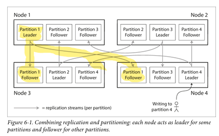
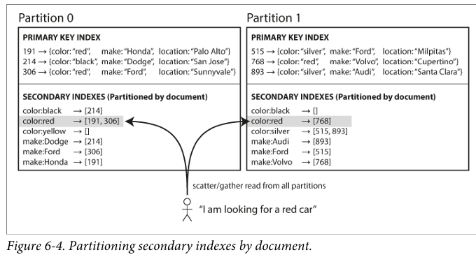

# Daily Log

**Date:** 2 February 2026

---

## ملخص اللي ذاكرته


- Chapter 6 Partitioning
  - Partitioning and Replication
  - Partitioning of Key-Value Data
    - Partitioning by Key Range
    - Partitioning by Hash of Key
    - Skewed Workloads and Relieving Hot Spots
  - Partitioning and Secondary Indexes
    - Partitioning Secondary Indexes by Document
    - Partitioning Secondary Indexes by Term
  - Rebalancing Partitions
    - Strategies for Rebalancing
    - Operations: Automatic or Manual Rebalancing

---

## تلخيصي للي ذاكرته + شرحي


بعد ما خلصنا الشابتر اللي فات و اتكلمنا عن الـ Replication، الشابتر ده بقى عن حاجة مهمة جدًا وهي **Partitioning** أو **Sharding**.

---

## ليه Replication لوحدها مش كفاية للـ Scalability؟

احنا كنا عرفنا إن الـ Replication ليها مميزات زي إن مفيش single point of failure، والـ reads بتبقى أسرع، وكده.  
بس المشكلة بتظهر لما الداتا نفسها تبقى ضخمة جدًا أو عدد الـ requests يبقى عالي جدًا.  

لو عندك 100 نسخة من نفس الداتا، فكلهم في الآخر شايلين نفس الحمل التقيل.  
يعني انت كررت المشكلة بدل ما تحلها.

الحل هنا إننا نكسر الداتا نفسها ونقسمها لحتت، وكل حتة تتحط على Node مختلفة.  
وده تعريف الـ **Partitioning (Sharding)**.

---

## يعني إيه Partition؟

يعني كل record يروح **Partition واحدة بس**.  
وكل Partition تعتبر Database صغيرة لوحدها.  

ممكن تعمل Query تجمع داتا من أكتر من Partition، وده مفيد جدًا لأنه بيكسر الكويريز الضخمة بدل ما تبقى كلها على Node واحدة.

---

## الهدف الأساسي من Partitioning

الهدف الأساسي هو **Scalability**.  
نظريًا، لو Node واحدة شايلة مليون request، فـ 10 Nodes يقدروا يشيلوا 10 مليون request.  

وده اللي اتكلمنا عليه قبل كده باسم **Shared-Nothing Clustering**،  
يعني كل Node ليها دنيتها الخاصة، والتواصل بينهم بيبقى عن طريق الشبكة بس.

غالبًا في الأنظمة الكبيرة الاتنين بيبقوا مع بعض:  
الداتا بتتقسم Partitioning، وكل Partition ليها نسخ تانية Replication.

زي الصورة دي:



---

## Partitioning of Key-Value Data

هنفترض إن عندنا Key-Value Data،  
ودايما بنوصل للداتا عن طريق الـ Key.

الهدف هنا إننا نوزع الحمل والداتا بشكل عادل.  
لو التوزيع مش عادل ده اسمه **Skew**،  
وأسوأ سيناريو إن Partition واحدة يبقى عليها كل الشغل والباقي نايمين، وده اسمه **Hotspot**.

---

## ليه ما نوزعش الداتا Random؟

لو وزعنا Random، التوزيع هيبقى أحسن شوية.  
بس لما نيجي ندور على Key معين، هنضطر نسأل كل الـ Nodes.  
وده مكلف وبطيء ومش عملي.

---

## Partitioning by Key Range

هنا بنقسم حسب قيمة الـ Key نفسها.  
مثال بالحروف:

A → C في Partition  
D → F في Partition  

الميزة إنك بتعرف على طول الـ Key موجود في أنهي Partition.  
فتبعت request مباشر للـ Node الصح.

بس المشكلة إن الداتا مش دايمًا بتتوزع بالتساوي.  
ممكن تلاقي Partition أكبر بكتير من التانية.

الحل إن حدود الـ Partitions تتظبط حسب شكل الداتا.  
يا إما يدوي،  
يا إما الـ Database تعمل ده أوتوماتيك.

الميزة الكبيرة هنا إنك بتدعم **Range Queries** زي:

```sql
WHERE key BETWEEN x AND y
````

العيب الكبير إن الترتيب ممكن يعمل **Hotspot**.

---

## Partitioning by Hash of Key

بدل ما نقسم حسب قيمة الـ Key نفسها،
نقسم حسب `hash(key)`.

الـ Hash هي Function بتاخد الـ Key وتطلع رقم شبه عشوائي،
صعب تتوقع من الرقم ده الـ Key الأصلي.

بنقسم الـ Hash Range نفسه على Partitions،
وكل Key يروح Partition حسب الـ Hash بتاعه.

النتيجة إن التوزيع بيبقى كويس ومفيش Skew تقريبًا.
بس العيب إنك كده فقدت **Range Queries**.

---

## Skewed Workloads & Hot Keys

حتى الـ Hash مش حل سحري.

لو كل الـ Requests على نفس Key،
زي مثال Post بتاع Celebrity وكل الناس بتعمل Comments على نفس `post_id`،
ساعتها كل الحمل هيبقى على Partition واحدة بس.

---

## Partitioning and Secondary Indexes

لحد دلوقتي كنا بنتكلم عن الـ Primary Key.
الـ Partition كان سهل نحدده باستخدام Key Range أو Hash.

المشكلة بتظهر لما نستخدم **Secondary Indexes**.
وهي Keys بتدور على مجموعة Records ومش Unique زي الـ Primary Key.

الـ Secondary Indexes مهمة جدًا،
وهي أساس أي Relational Database،
وفي Engines معمولة مخصوص علشانها.

بس طبعًا بتعمل تحدي في Partitioning.

---

## الحلول مع Secondary Indexes

في حلّين مشهورين:

* Document-based Partitioning
* Term-based Partitioning

---

## Partitioning Secondary Indexes by Document



افترض عندك موقع عربيات مستعملة،
وكل إعلان ليه `document_id`.

التقسيم بيبقى مثلًا:

Partition 0: IDs من 0 → 499
Partition 1: IDs من 500 → 999

يعني التقسيم حسب الـ Document ID.

لو عايزين نعمل Search زي:

* color = red
* make = BMW

بنعمل Secondary Index على `color` و `make`.

اللي بيحصل إن كل Partition ليها الـ Indexes بتاعتها لوحدها.
مش فارق معاها Partitions التانية خالص.
علشان كده اسمها **Local Index**.

الميزة إن الـ Writes سهلة وسريعة.
لما تضيف Document، تروح Partition واحدة وتعدل Index واحدة.
مفيش Network Fan-out ولا Distributed Coordination.

العيب إن الـ Reads مكلفة جدًا.
لو اليوزر قال هاتلي كل العربيات الحمرا،
انت مش عارف أنهي Partition فيها البيانات،
فبتبعت Request لكل الـ Partitions.

وده اسمه **Scatter/Gather**،
وبيكون بطيء ومكلف للشبكة.

---

## Partitioning Secondary Indexes by Term

هنا بنتكلم عن **Global Index**.

بدل ما كل Partition ليها Index،
نعمل Index واحدة لكل الداتا.

بس مينفعش تتحط على Node واحدة،
لأنها هتبقى Bottleneck وتكسر فكرة Partitioning أصلاً.

الحل إننا نعمل Global Index **متقسمة**.
Index واحدة منطقيًا،
بس متوزعة فعليًا على Nodes مختلفة.

مثال العربيات:

```text
color:red → [12, 45, 120, 501, 720]
```

التقسيم يكون مثلًا:

* colors من A → R في Partition
* colors من S → Z في Partition

يعني `red` كله في حتة واحدة
بغض النظر عن الـ Document موجود في أنهي Partition.

اسمها **Term-Partitioned**
لأن التقسيم حسب الـ Term مش حسب الـ Document.

والـ Term هنا يعني حاجة زي:

* color:red
* make:bmw

والاسم جاي من فكرة **Full-Text Search**
حيث الـ Terms هي الكلمات.

---

## Rebalancing Partitions

يعني إيه Rebalancing؟
مع الوقت أي Database Cluster بيتغير.
اليوزرز بتزيد، والداتا بتكبر.

ساعتها لازم نحرك الداتا والـ Requests بين الـ Nodes.
وده اسمه **Rebalancing**.

---

## Rebalancing لازم يحقق إيه؟

* **Fair Distribution**
  بعد الـ Rebalancing، كل Node تكون شايلة شغل قريب من التانية،
  مش واحدة مليانة والباقي نايم.

* **System Availability**
  السيستم يفضل شغال أثناء الـ Rebalancing،
  والـ Users تعمل Read و Write عادي من غير Downtime.

* **Minimal Data Movement**
  أقل حركة داتا ممكنة،
  علشان العملية تبقى أسرع وأقل تكلفة.
