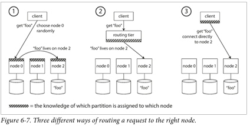

# Daily Log

**Date:** 3 February 2026

---

## ملخص اللي ذاكرته

- Chapter 6 Partitioning
  - Request Routing
    - Parallel Query Execution
- Chapter 7 Transactions
  - The Slippery Concept of a Transaction
    - The Meaning of ACID
    - Single-Object and Multi-Object Operations

---

## تلخيصي للي ذاكرته + شرحي

Request Routing
بعد ما اتكلمنا ف اول الشابتر عن ان الداتا بتتوزع والداتا بتتقسم خلاص 
دلوقت لما ال clinet يطلب اي key  الطلب بتاعه هيروح فين و علي انهي نود؟ ب انهي IP وانهي Port ؟
و بسبب ان ممكن node تدخل او تخرج وكدا لازم حد يبقي عارف الدنيا و دا اسمه Service Discovery

في 3 طرق مشهورة للـ Request Routing
 اول حاجه ابعت على أي Node وخلاص (Forwarding)
 هنا الكلاينت يبعت علي اي حاجه غالبا بتروح عن طريه load balancer و لو ال node معاه partition يرد لو لا يروح للي بعده

 تاني حاجه Routing Tier
 client → routing layer
routing layer تعرف key ده تابع أنهي partition partition ده على أنهي node

تالت حاجه Client ذكي (Partition-aware client)
الـ client نفسه فاهم الـ partitioning وتوزيع الـ partitions على الـ nodesيروح مباشرة للـ node الصح

