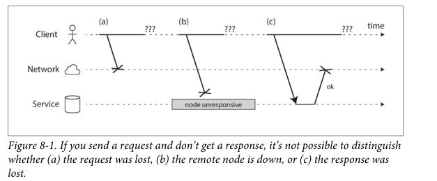

# Daily Log

**Date:** 8 February 2026

---

## ملخص اللي ذاكرته

- Chapter 8 The Trouble with Distributed Systems
  - Faults and Partial Failures
    - Cloud Computing and Supercomputing
  - Unreliable Networks
    - Network Faults in Practice
    - Detecting Faults
    - Timeouts and Unbounded Delays
    - Synchronous Versus Asynchronous Networks

---

## تلخيصي للي ذاكرته + شرحي

## Chapter 8: The Trouble with Distributed Systems

الشابتر ده بيتكلم عن مشاكل الـ Distributed Systems، والمشاكل دي مش بتيجي من الكود بس، لا دي بتيجي كمان من الشبكات، والسيرفرات، والزمن نفسه. يعني حتى لو الكود بتاعك مظبوط، الواقع حواليك ممكن يبوظ الدنيا، وده اللي الشابتر بيحاول يوضحه واحدة واحدة.

### Partial Failure

أول مشكلة عندنا هي الـ Partial Failure.
في الطبيعي، لو إنت شغال على جهاز واحد، الدنيا بسيطة: جهازك يا شغال يا واقع، مفيش حاجة في النص.
إنما في الـ distributed systems الموضوع مختلف، ممكن جزء من السيستم يكون شغال، وجزء واقع، وجزء تالت شغال بس مش بيرد، وانت من بره مش عارف بالظبط إيه اللي حاصل. الحالة اللي تبقى فيها مش عارف تحدد السيستم شغال ولا واقع دي هي التعريف الحقيقي للـ Partial Failure.

### Network Problems

كمان الشبكة نفسها من أكبر المشاكل في الـ distributed systems.
مثلا لو انت بعت request، فيه سيناريوهات كتير ممكن تحصل: ممكن الريكوست يضيع، ممكن يوصل بعد 10ms، ممكن بعد 10 ثواني، ممكن السيرفر يستقبل الريكوست ويشتغل عليه بس الـ response يضيع في السكة، وممكن السيرفر يكون شغال عادي بس الـ GC وقفه 30 ثانية.
ولو الـ response مجاش، مستحيل تعرف الغلط حصل فين بالظبط، وده طبعًا مشكلة كبيرة جدًا.

### Synchronous vs Asynchronous Networks

الجزء ده بيتكلم عن فرق مهم جدًا اسمه Synchronous vs Asynchronous Networks.
الفكرة الأساسية هنا: ليه الشبكة مش مضمونة؟ وليه مش بنخليها مضمونة وخلاص ونرتاح؟

الكاتب بيقول إن لو الشبكة كانت بتوصل أي packet في وقت معروف وثابت، ومبتضيعش packets، الدنيا كانت هتبقى سهلة جدًا، والـ software مكنش هيشيل كل الحمل ده. بس للأسف ده مش اللي حاصل.

عشان نفهم السبب، بنقارن بين الإنترنت وشبكة التليفونات القديمة.
التليفون الأرضي زمان كان نادر جدًا إن المكالمة تقطع أو الصوت يتأخر، والسبب إن أول ما تكلم حد، الشبكة بتحجزلك circuit كامل من عندك لحده. يعني خط محجوز، bandwidth ثابت، latency ثابت، وطول ما المكالمة شغالة محدش تاني يشاركك في الخط ده.

النوع ده من الشبكات اسمه synchronous network، وبيكون مفيش فيه queue، ولا زحمة، ولا مفاجآت، والتأخير ليه حد أقصى معروف.

### Packet Switching and the Internet

الإنترنت بقى مش كده خالص.
TCP مش بيحجز خط، ولا bandwidth، ولا يضمن وقت وصول. هو بس بيبعت packets وسط الزحمة، لو في مساحة يعدي، لو في زحمة يستنى، ولو packet ضاعت يعيدها تاني.
وده اسمه packet switching، والشبكة هنا asynchronous، يعني التأخير ملوش سقف ثابت.

طب ليه اخترنا الطريقة دي؟
عشان الإنترنت معمول لحاجة اسمها bursty traffic، زي تحميل صفحة، API call، فايل، إيميل. حاجات بتيجي فجأة وتمشي فجأة.

لو استخدمت circuit في الحالات دي، يا إما تحجز bandwidth قليل فيبقى التحميل بطيء، يا إما تحجز bandwidth كبير فالشبكة تقولك مش فاضية. في الحالتين هتضيّع موارد، وهتبقى أغلى وأبطأ.

إنما TCP ذكي، بيزوّد السرعة لما الشبكة فاضية، ويهدّي لما الشبكة زحمة، وبيستغل أي حاجة متاحة في اللحظة دي.
أيوه ده معناه queue وتأخير متغير، بس معناه كمان إن الشبكة مستخدمة بأقصى كفاءة، والتكلفة أقل.

### Resource Utilization Analogy

وبنفس المنطق ده، شوف الـ CPU.
لو كل thread ليه وقت ثابت ومحجوز، latency يبقى ثابت، بس الـ CPU نصه فاضي.
إنما لو threads بتتزاحم، latency يبقى متغير، بس utilization عالي.
والـ cloud كله مبني على الفكرة دي أصلا.

